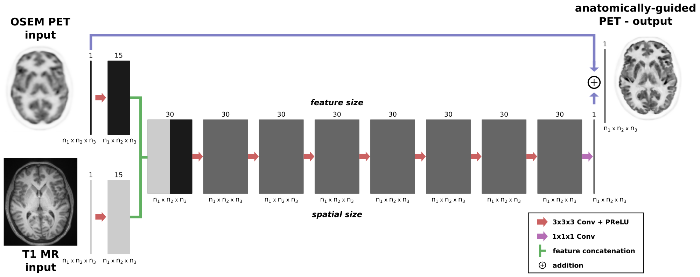

## What is pyapetnet?

pyapetnet is a pure python package for training and use of convolutional
neural network that does anatomy-guided deconvolution and denoising of PET images
in image space.

The idea of pyapetnet is to obtain the image quality of MAP PET reconstructions
using an anatomical prior (the asymmetric Bowsher prior) using a CNN in image space.
The latter has the advantage that (a) no access to PET raw data is needed and (b)
that the predictions are much faster compared to a classical iterative PET reconstruction.

The package contains already trained CNN models, the source code for predictions
from standard nifti and dicom images, and the source code to train your own model
and is published under [MIT license](https://github.com/gschramm/pyapetnet/blob/master/LICENSE).



## Live Demo

An interactive online demo that does not require any installation (just a google account)
can be run [here](https://colab.research.google.com/drive/17R84I3asw81FgbXUaqHMMkmA7HzwNvS2#scrollTo=crao9VE7Wiq3).

Note that this demo by default runs on purely simulated data for which the model was not trained.

## How to use it?

If you want to use the package yourself, get the latest release from our 
[github repository](https://github.com/gschramm/pyapetnet/releases) and follow the installation instructions [here](https://github.com/gschramm/pyapetnet/blob/master/README.md).

Once installed, you can run a few demos that show how to make predictions from nifti or dicom
files, or how to train your own model.

## References

If you are using pyapetnet for your research, please cite our paper:

G. Schramm et al., ["Approximating anatomically-guided PET reconstruction in image
space using a convolutional neural network"](https://doi.org/10.1016/j.neuroimage.2020.117399), 
*published online* in NeuroImage, DOI 10.1016/j.neuroimage.2020.117399


## Bug / problem reports

If you discover bugs or unexpected behavior, please create a new issue [here](https://github.com/gschramm/pyapetnet/issues).

## FAQ

**1. What input images are required for pyapetnet**?

Our trained models require two 3D input images:

* a standard OSEM PET image (resolution around 5mm)
* a high resolution anatomical T1 MR image (voxel size should be approx. isotropic and around 1mm) 

The images can be provided in nifti or dicom format (see demos on how to predict from nifti or dicom).
The PET and MR images do not need to originate from a hybrid PET/MR scanner (see below).

---

**2. pyapnet comes with multiple trained networks. Which one should I use?**

We release different CNNs that were trained on different data sets and with slightly different target images (different levels of regularizations). To choose a model that fits best to your data and your task you should:

* Determine whether your PET OSEM reconstructions where reconstructed with or without resolution modeling. We release models that were trained on OSEM images reconstructed with and without resolution (point spread function) modeling.
* Which level of regularization (resolution vs noise trade-off) you prefer. This is reflected in the beta parameter of the target MAP reconstruction using the Bowsher prior. Lower beta means less regularization (more noise) and higher beta values mean more regularization (less noise). For typical 5-20min static FDG brain acquisitions, beta = 10 is usually a good compromise. However, for other tracers and tasks different beta levels might be better. We recommend to try CNNs trained with different beta values.

The subdirectory ```trained_models``` contains an [overview file](https://github.com/gschramm/pyapetnet/blob/master/pyapetnet/trained_models/model_description.md) that describes what kind of data was used for the training of the released models.

*To guarantee reproducibility it is crucial to remember which trained model was used!*

---

**3. Can I use the provided models for non-FDG acquisitions?**

It is our aim to train and release models that are independent of the PET tracer. To do so we train the models on data from different tracers (e.g. [18F]FDG and [18F]PE2I). Models trained on those two tracers also showed good performance on [18F]FET acquisitions which is why we are confident that the model performance is not tracer dependent.

---

**4. Do I need data from hybrid PET/MR scanners to use pyapetnet?**

No. The PET and MR images can come from different acquisitions (scanners). The preprocessing routines of pyapetnet have the possibility to rigidly align the input images by optimizing mutual information (see demos).

---
